# Genesis — Architecture Documentation

> AI-powered HighLevel CRM app builder. Users describe what they want in plain English; Genesis generates, previews, and deploys live HTML+JS apps that read real CRM data.

---

## Table of Contents

1. [Project Overview](#1-project-overview)
2. [High-Level Architecture](#2-high-level-architecture)
3. [Directory Structure](#3-directory-structure)
4. [Frontend Architecture](#4-frontend-architecture)
5. [Backend Architecture (Cloud Functions)](#5-backend-architecture-cloud-functions)
6. [Data Flow — Generation Pipeline](#6-data-flow--generation-pipeline)
7. [SSE Event Protocol](#7-sse-event-protocol)
8. [HighLevel OAuth & API Flow](#8-highlevel-oauth--api-flow)
9. [Firestore Data Model](#9-firestore-data-model)
10. [Preview Iframe Architecture](#10-preview-iframe-architecture)
11. [Authentication Flow](#11-authentication-flow)
12. [LLM Response Parsing Pipeline](#12-llm-response-parsing-pipeline)
13. [Snapshot System](#13-snapshot-system)
14. [State Management (Pinia Stores)](#14-state-management-pinia-stores)
15. [Security Model](#15-security-model)
16. [Deployment Architecture](#16-deployment-architecture)
17. [Key Design Decisions](#17-key-design-decisions)
18. [Environment Variables Reference](#18-environment-variables-reference)
19. [API Reference](#19-api-reference)

---

## 1. Project Overview

Genesis is a full-stack SaaS platform that lets HighLevel CRM users describe dashboards and tools in natural language. The AI generates complete, self-contained HTML+JS apps that call real HighLevel CRM data through a secure proxy — no coding required.

### Core User Journey

```
User types prompt → AI generates code → Files saved to Firestore
→ Live preview in iframe → Token injected via postMessage → Real CRM data loads
```

### Tech Stack

| Layer          | Technology                                                           |
| -------------- | -------------------------------------------------------------------- |
| Frontend       | Vue 3 (Composition API), Pinia, Vue Router, Tailwind CSS, TypeScript |
| Backend        | Firebase Cloud Functions (Node.js 20, TypeScript)                    |
| Database       | Cloud Firestore                                                      |
| Auth           | Firebase Authentication (Email/Password)                             |
| AI — Primary   | Anthropic Claude (`claude-sonnet-4-6`)                               |
| AI — Secondary | HuggingFace `Qwen/Qwen2.5-Coder-7B-Instruct` (optional)              |
| CRM            | HighLevel API v2 via `leadconnectorhq.com`                           |
| Hosting        | Firebase Hosting (frontend) + Cloud Functions (backend)              |

---

## 2. High-Level Architecture

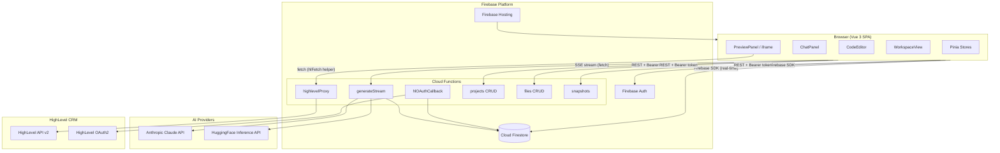

---

## 3. Directory Structure

```
genesis/
├── frontend/                    # Vue 3 SPA
│   └── src/
│       ├── assets/
│       │   └── globals.css          # Tailwind base + CSS vars
│       ├── components/
│       │   ├── ui/                  # Button, Input, Badge, Card, Label
│       │   ├── dashboard/
│       │   │   └── CreateProjectDialog.vue
│       │   └── workspace/
│       │       ├── ChatPanel.vue        # Prompt input + message list
│       │       ├── CodeEditor.vue       # Read-only code viewer
│       │       ├── FileTree.vue         # Left sidebar file navigator
│       │       ├── PreviewPanel.vue     # iframe srcdoc preview
│       │       └── SnapshotDrawer.vue   # Restore prior generations
│       ├── router/
│       │   └── index.ts             # Vue Router + auth guards
│       ├── services/
│       │   └── firebase.ts          # Firebase app + Firestore + Auth init
│       ├── stores/
│       │   ├── auth.ts              # Firebase Auth state
│       │   ├── highlevel.ts         # HL connection status + OAuth URL
│       │   ├── projects.ts          # Project list CRUD
│       │   └── workspace.ts         # Files, messages, SSE stream, generation
│       ├── types/
│       │   └── index.ts             # All TypeScript interfaces + SSEEvent union
│       └── views/
│           ├── LoginView.vue
│           ├── SignupView.vue
│           ├── DashboardView.vue
│           ├── WorkspaceView.vue
│           └── OAuthCallbackView.vue
│
├── functions/src/               # Firebase Cloud Functions
│   ├── admin.ts                 # firebase-admin init (db, auth exports)
│   ├── cors.ts                  # CORS middleware — wildcard, all origins
│   ├── index.ts                 # Function exports (entry point)
│   ├── auth/
│   │   └── middleware.ts        # verifyAuth — extracts + validates Firebase ID token
│   ├── generation/
│   │   ├── index.ts             # generateStream — SSE endpoint + LLM orchestration
│   │   ├── parser.ts            # parseLLMResponse — 6-strategy fallback parser
│   │   └── prompt.ts            # buildSystemPrompt — HL context + output format
│   ├── files/
│   │   └── index.ts             # listFiles, getFile, saveFile
│   ├── highlevel/
│   │   ├── client.ts            # createHLClient — Axios + auto token refresh
│   │   ├── contacts.ts          # listContacts
│   │   ├── conversations.ts     # listConversations
│   │   ├── calendars.ts         # getAppointments, listCalendars
│   │   ├── oauth.ts             # hlOAuthCallback + refreshHighLevelToken
│   │   ├── proxy.ts             # highlevelProxy — unified HL data endpoint
│   │   └── dummy.ts             # getDummyContacts/Conversations/Appointments/Calendars
│   ├── projects/
│   │   └── index.ts             # listProjects, createProject, updateProject, deleteProject
│   └── snapshots/
│       └── index.ts             # listSnapshots, restoreSnapshot, createSnapshot
│
├── firestore.rules              # Security rules — user-scoped ownership checks
├── firestore.indexes.json       # Composite indexes for ordered queries
├── firebase.json                # Hosting rewrite rules + function regions
└── package.json                 # Root workspace
```

---

## 4. Frontend Architecture

### 4.1 Vue Router — Route Map

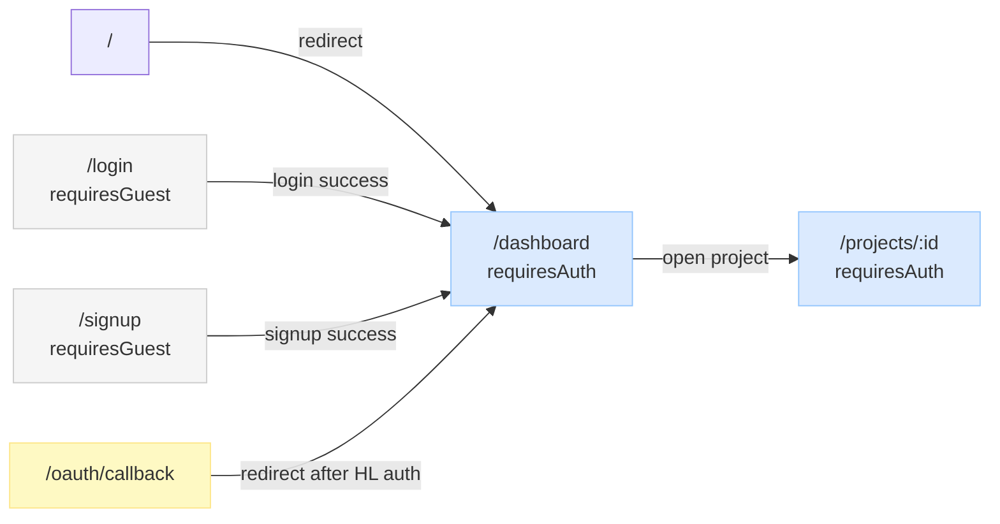

**Auth Guard logic** (`router/index.ts`):

- `requiresAuth` → redirect to `/login` if not authenticated
- `requiresGuest` → redirect to `/dashboard` if already authenticated
- Auth store's `init()` is awaited before any navigation decision

---

### 4.2 Workspace Layout

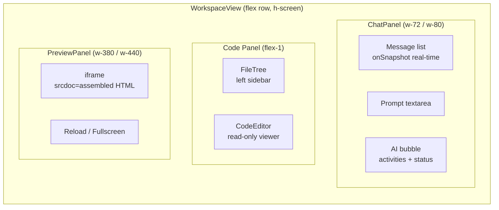

All three panels can be toggled on/off. **Fullscreen mode** hides chat + code panels entirely.

---

### 4.3 Pinia Store Dependency Graph

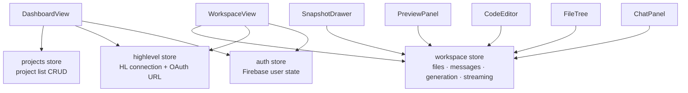

---

### 4.4 Workspace Store — Internal State

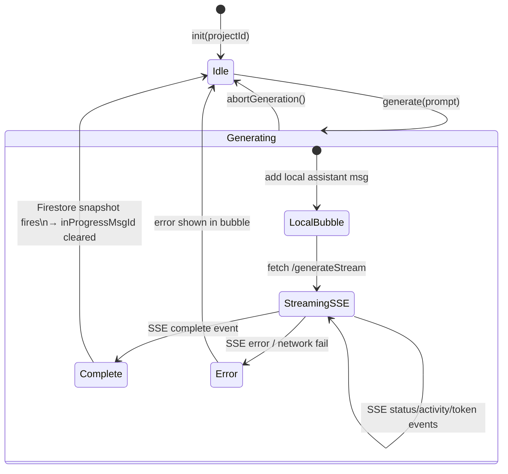

**Key refs in workspace store:**

| Ref                     | Type                     | Purpose                                                                                        |
| ----------------------- | ------------------------ | ---------------------------------------------------------------------------------------------- |
| `messages`              | `Message[]`              | Merged Firestore remote + local in-progress bubble                                             |
| `inProgressMsgId`       | `string \| null`         | ID of local assistant bubble shown during generation                                           |
| `inProgressStartTime`   | `number \| null`         | Epoch ms when generation started — used to distinguish new vs old Firestore assistant messages |
| `streamingFileContents` | `Record<string, string>` | Live file content accumulating from SSE token events                                           |
| `activeStreamFile`      | `string \| null`         | Which file is currently receiving token chunks                                                 |
| `generationState`       | `GenerationState`        | `isGenerating`, `status`, `error`, `currentFile`                                               |

---

## 5. Backend Architecture (Cloud Functions)

### 5.1 Function Inventory

| Function          | Trigger      | Auth                  | Purpose                                            |
| ----------------- | ------------ | --------------------- | -------------------------------------------------- |
| `generateStream`  | HTTPS POST   | Firebase ID token     | Main AI generation — SSE stream                    |
| `highlevelProxy`  | HTTPS GET    | Firebase ID token     | Proxy all HL CRM API calls from generated apps     |
| `hlOAuthCallback` | HTTPS GET    | None (OAuth redirect) | Exchange HL auth code → tokens, store in Firestore |
| `listProjects`    | HTTPS GET    | Firebase ID token     | List user's projects                               |
| `createProject`   | HTTPS POST   | Firebase ID token     | Create new project                                 |
| `updateProject`   | HTTPS PATCH  | Firebase ID token     | Rename / re-describe project                       |
| `deleteProject`   | HTTPS DELETE | Firebase ID token     | Soft-delete (sets `deletedAt`)                     |
| `listFiles`       | HTTPS GET    | Firebase ID token     | List files in a project                            |
| `getFile`         | HTTPS GET    | Firebase ID token     | Get single file content                            |
| `saveFile`        | HTTPS POST   | Firebase ID token     | Upsert a file manually                             |
| `listSnapshots`   | HTTPS GET    | Firebase ID token     | List past generation snapshots                     |
| `restoreSnapshot` | HTTPS POST   | Firebase ID token     | Restore all files to a past snapshot               |

---

### 5.2 Auth Middleware

Every function (except `hlOAuthCallback`) calls `verifyAuth(req)` as its first step:

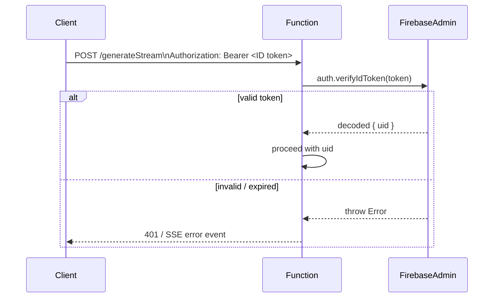

---

### 5.3 generateStream — Internal Flow

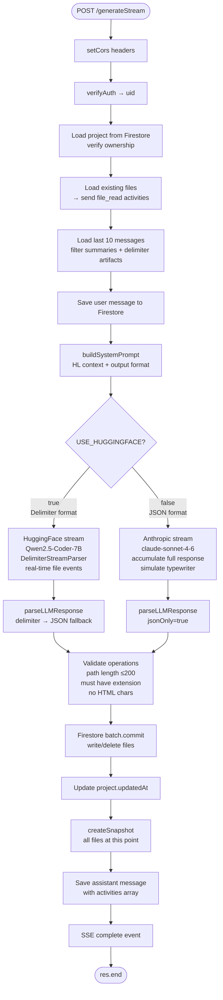

---

## 6. Data Flow — Generation Pipeline

This is the most complex flow in the system — from user prompt to live preview.

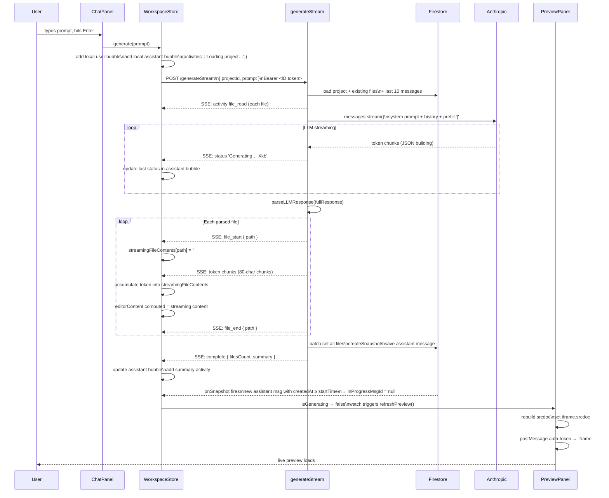

---

## 7. SSE Event Protocol

The `generateStream` function streams **Server-Sent Events** to the frontend. All events follow the format:

```
event: <type>\ndata: <JSON>\n\n
```

### Event Type Reference

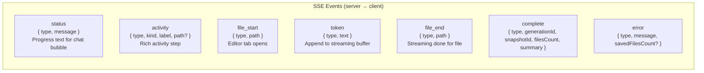

### Activity Kinds

| `kind`        | Icon    | Color  | Meaning                                 |
| ------------- | ------- | ------ | --------------------------------------- |
| `status`      | spinner | muted  | Transient progress text (last one wins) |
| `file_read`   | 📂      | yellow | Existing file read at generation start  |
| `file_write`  | ✏️      | blue   | File written by this generation         |
| `file_delete` | 🗑️      | red    | File deleted by this generation         |
| `summary`     | ✅      | green  | Final completion summary                |

### Frontend SSE Handling (workspace store)

```mermaid
flowchart TD
    SSE[SSE event received] --> Switch{event.type}

    Switch -- status --> UpdateLastStatus[Replace last status activity\nin assistant bubble]
    Switch -- activity --> AddActivity[Append activity to bubble]
    Switch -- file_start --> OpenStreamBuffer[streamingFileContents path = ''\nactiveStreamFile = path\nactiveFilePath = path]
    Switch -- token --> AppendToken[streamingFileContents[path] += text\neditorContent computed updates]
    Switch -- file_end --> ClearActiveFile[activeStreamFile = null]
    Switch -- complete --> UpdateBubble[Update bubble content + summary\nfilter status activities\nauto-select index.html]
    Switch -- error --> ShowError[generationState.error = message]
```

---

## 8. HighLevel OAuth & API Flow

### 8.1 OAuth Authorization Flow

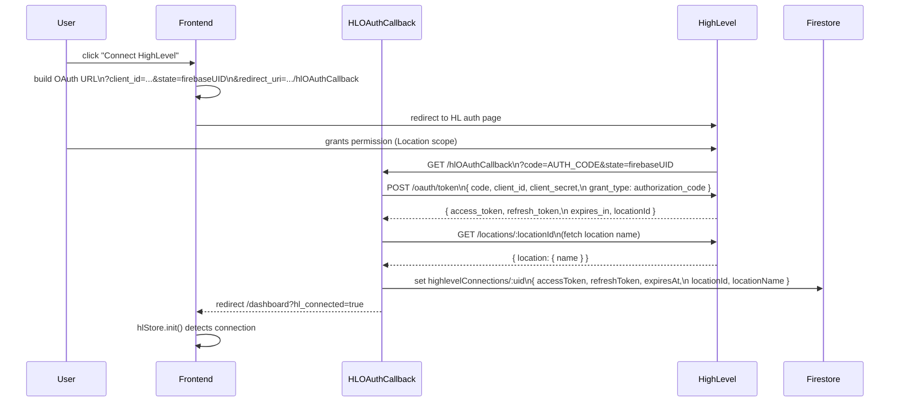

### 8.2 Token Auto-Refresh

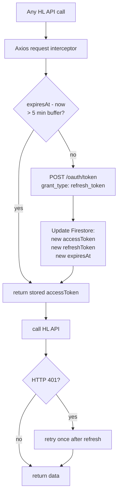

### 8.3 highlevelProxy — Resource Router

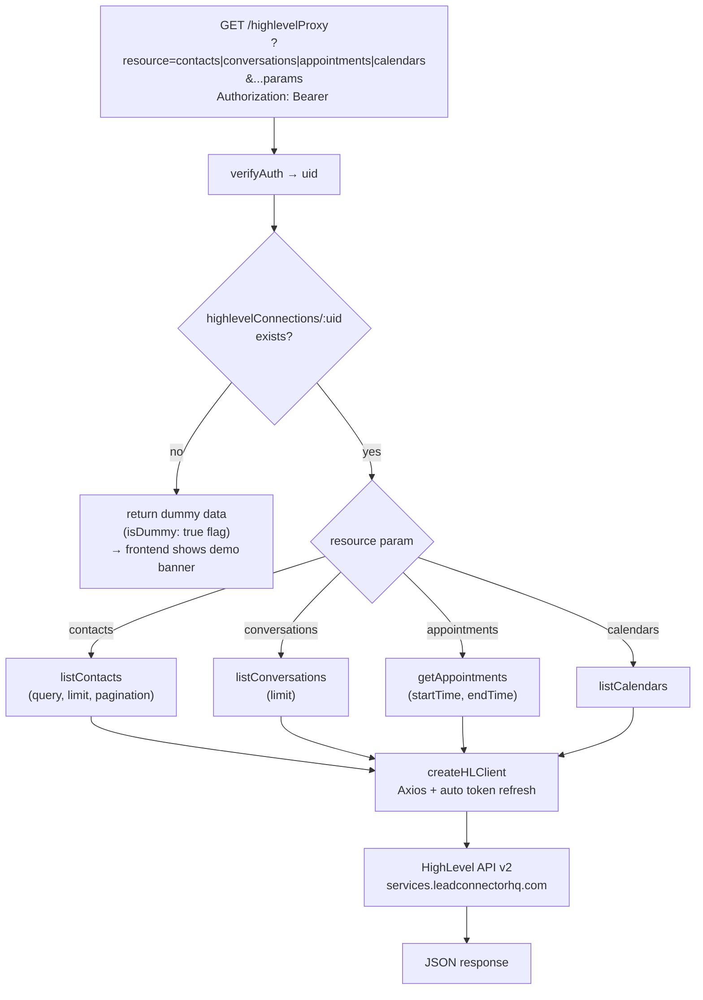

---

## 9. Firestore Data Model

### 9.1 Collection Hierarchy

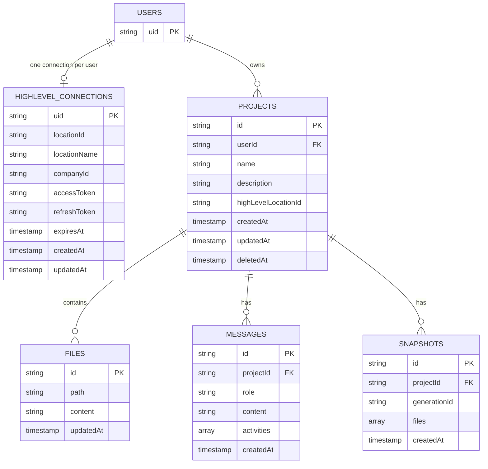

### 9.2 Document Shapes

**`highlevelConnections/:uid`**

```
{
  userId: string,
  locationId: string,           // HL sub-account location
  locationName: string,         // human-readable, fetched from /locations
  companyId: string,
  accessToken: string,          // HL OAuth access token (short-lived)
  refreshToken: string,         // HL OAuth refresh token (1 year, rotates on use)
  expiresAt: Timestamp,
  createdAt: Timestamp,
  updatedAt: Timestamp
}
```

**`projects/:projectId`**

```
{
  userId: string,               // Firebase UID — ownership key
  name: string,
  description: string,
  highLevelLocationId: string,
  createdAt: Timestamp,
  updatedAt: Timestamp,
  deletedAt: Timestamp | null   // soft delete
}
```

**`projects/:projectId/files/:fileId`**

```
fileId = path.replace(/\//g, '__')   // e.g. "src/app.js" → "src__app.js"

{
  path: string,                // e.g. "index.html", "app.js"
  content: string,             // full file content
  updatedAt: Timestamp
}
```

**`projects/:projectId/messages/:msgId`**

```
{
  projectId: string,
  role: 'user' | 'assistant',
  content: string,
  activities: [                // only on assistant messages
    { kind: 'file_read' | 'file_write' | 'file_delete' | 'summary' | 'status',
      label: string,
      path?: string }
  ],
  createdAt: Timestamp
}
```

**`projects/:projectId/snapshots/:snapshotId`**

```
{
  generationId: string,        // "gen_<timestamp>"
  files: [
    { path: string, content: string }
  ],
  createdAt: Timestamp
}
```

### 9.3 Firestore Security Rules Summary

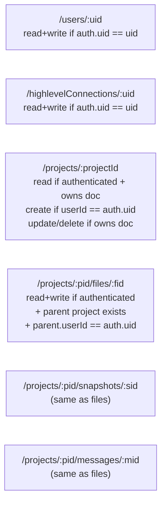

All Cloud Functions bypass Firestore rules because they use the **Admin SDK** (`firebase-admin`) which has elevated privileges. Rules protect direct client-SDK access only.

---

## 10. Preview Iframe Architecture

The preview panel assembles a **fully self-contained HTML document** from the project's files and sets it as `iframe.srcdoc`. No separate server needed.

### 10.1 srcdoc Assembly (PreviewPanel.vue)

```mermaid
flowchart TD
    Start[computed: srcdoc] --> FindIndex{index.html exists?}
    FindIndex -- no --> NullSrc[return null\nshow empty state]
    FindIndex -- yes --> StartHTML[html = indexFile.content]

    StartHTML --> InlineJS[for each .js file:\nreplace script src tag\nOR append before /body]
    InlineJS --> InlineCSS[for each .css file:\nreplace link href tag\nwith inline style block]
    InlineCSS --> InjectBootstrap[prepend to head:\nwindow.__GENESIS_PROXY__\nwindow.__proxyBase URLs]

    InjectBootstrap --> SetSrcDoc[iframe.srcdoc = assembled HTML]
    SetSrcDoc --> IframeLoad[iframe loads, runs\napp bootstrap script]
    IframeLoad --> WaitToken[app waits for\nwindow.onGenesisReady()]
    WaitToken --> PostMessage[parent postMessage\n{ type: auth-token, token: FirebaseIDToken }]
    PostMessage --> AppStart[app calls hlFetch()\n→ GET /highlevelProxy?resource=...]
```

### 10.2 Token Injection via postMessage

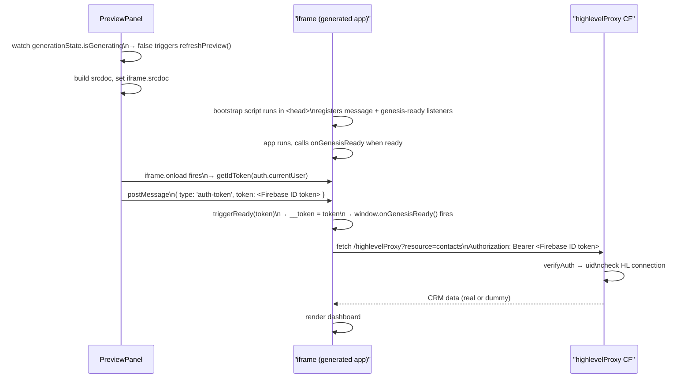

---

## 11. Authentication Flow

```mermaid
flowchart TD
    AppStart[App loads\nmain.ts] --> RouterInit[router.beforeEach\nawait authStore.init()]
    RouterInit --> AuthListener[onAuthStateChanged\nFirebase SDK]

    AuthListener -- "user exists" --> Authenticated[firebaseUser = user\nisAuthenticated = true]
    AuthListener -- "no user" --> Guest[firebaseUser = null\nisAuthenticated = false]

    Authenticated --> Dashboard[→ /dashboard]
    Guest --> Login[→ /login]

    Login --> LoginForm[email + password]
    LoginForm --> FirebaseAuth[signInWithEmailAndPassword]
    FirebaseAuth -- success --> TokenStore[Firebase SDK stores\nID token + refresh token\nin localStorage]
    TokenStore --> RouteGuard[router redirects\nto /dashboard]

    TokenStore --> AutoRefresh[Firebase SDK auto-refreshes\nID token every ~55 min]
    AutoRefresh --> APICall[All CF calls:\ngetIdToken → Bearer header]
```

---

## 12. LLM Response Parsing Pipeline

The parser (`generation/parser.ts`) uses a **6-strategy waterfall** — each strategy is attempted in order, stopping at the first that yields at least one file operation.

````mermaid
flowchart TD
    Input[LLM raw response string] --> S1

    S1{Strategy 1\nDelimiter format\nSkipped if jsonOnly=true}
    S1 -- "<<<FILE:path>>>\n...content...\n<<<END_FILE>>>" --> Ops[FileOperation array]
    S1 -- not found --> S2

    S2{Strategy 2\nStrip markdown fences\ndirect JSON.parse}
    S2 -- valid JSON array --> Ops
    S2 -- fails --> S3

    S3{Strategy 3\nBracket extraction\noutermost [ ... ]\nJSON.parse}
    S3 -- valid --> Ops
    S3 -- fails --> S4

    S4{Strategy 4\nJSON string repair\nescape bare newlines\nthen parse}
    S4 -- valid --> Ops
    S4 -- fails --> S5

    S5{Strategy 5\nRegex object extraction\npull path + operation\n+ content manually}
    S5 -- found --> Ops
    S5 -- nothing --> S6

    S6{Strategy 6\nMarkdown block extraction\n``` html/js/css blocks\nmapped to filenames}
    S6 -- blocks found --> Ops
    S6 -- nothing --> Error[return operations=[]\nwarn in logs]

    Ops --> Validate[For each operation:\npath.length <= 200\nmust match /\.[a-z]{1,5}$/\nno < or newlines in path]
    Validate --> Clean[sanitizePath\nstrip ../ prefixes\nstrip leading /]
    Clean --> Return[FileOperation[]]
````

### LLM Output Formats

**Anthropic path (JSON)**:

```json
[
  { "operation": "write", "path": "index.html", "content": "<!DOCTYPE html>..." },
  { "operation": "write", "path": "app.js", "content": "window.onGenesisReady = ..." },
  { "operation": "delete", "path": "old.js" }
]
```

**HuggingFace path (Delimiters)**:

```
<<<FILE:index.html>>>
<!DOCTYPE html>...
<<<END_FILE>>>
<<<DELETE:old.js>>>
```

**Anthropic Prefill Trick**: The system appends an assistant turn starting with `[` before sending to Anthropic. This forces the model to continue the JSON array — it cannot output plain text or delimiters because it's already "started" with `[`.

---

## 13. Snapshot System

Every successful generation creates a **full snapshot** — a complete copy of all files at that point in time.

```mermaid
flowchart LR
    Gen[Generation completes] --> MergeFiles[Merge:\nexistingFiles map\n+ newlySavedFiles\n- deletedFiles]
    MergeFiles --> SnapDoc["snapshots/:snapshotId\n{ generationId, files[], createdAt }"]

    Restore[User clicks Restore] --> ListSnaps[GET /listSnapshots\nshows last 20]
    ListSnaps --> PickSnap[User picks a snapshot]
    PickSnap --> RestoreCall[POST /restoreSnapshot\n{ projectId, snapshotId }]
    RestoreCall --> DeleteAll[batch.delete\nall current files]
    DeleteAll --> RewriteAll[batch.set\nall snapshot files]
    RewriteAll --> Firestore[Firestore\nonSnapshot fires\nUI updates instantly]
```

**Snapshot storage**: Full file contents (not diffs). Trade-off: simple and reliable at this scale; would need delta compression for large projects.

---

## 14. State Management (Pinia Stores)

### 14.1 `auth` store

```
state: firebaseUser, loading, error
getters: user (mapped), isAuthenticated
actions: init(), signup(), login(), logout(), clearError()
```

### 14.2 `highlevel` store

```
state: connection (HL connection doc), loading
getters: isConnected, locationName, locationId
actions: init() → onSnapshot highlevelConnections/:uid
         getOAuthUrl(uid) → builds HL OAuth URL with state=uid
         destroy() → unsubscribe
```

### 14.3 `projects` store

```
state: projects[], loading, error
actions: fetchProjects() → GET /listProjects
         createProject(input) → POST /createProject
         updateProject(id, input) → PATCH /updateProject/:id
         deleteProject(id) → DELETE /deleteProject/:id
```

### 14.4 `workspace` store (most complex)

```
state:
  projectId, files[], messages[], snapshots[]
  activeFilePath, generationState
  streamingFileContents{}, activeStreamFile
  inProgressMsgId, inProgressStartTime

computed:
  activeFile → files.find(activeFilePath)
  fileTree   → { dir: [path, ...] } grouped
  editorContent → streamingFileContents[activeStream] ?? activeFile.content

real-time listeners:
  filesUnsub   → onSnapshot projects/:pid/files    (ordered by path)
  messagesUnsub → onSnapshot projects/:pid/messages (ordered by createdAt asc)
    └── merges remote messages with local in-progress bubble
    └── drops bubble when new remote assistant msg createdAt >= inProgressStartTime

actions:
  init(pid), destroy()
  selectFile(path), saveFile(path, content)
  generate(prompt) → full SSE flow
  abortGeneration() → abortController.abort()
  restoreSnapshot(id), fetchSnapshots()
```

---

## 15. Security Model

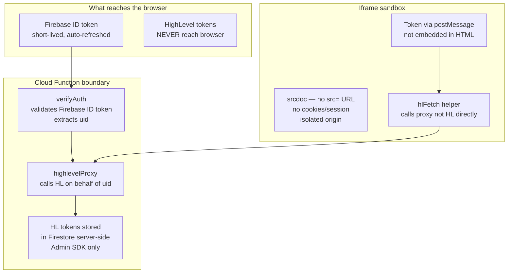

### Security Properties

| Property                          | Implementation                                                           |
| --------------------------------- | ------------------------------------------------------------------------ |
| HL tokens never in browser        | Stored in Firestore server-side, accessed via Admin SDK only             |
| Token injection without embedding | `postMessage` from parent → iframe, not in HTML source                   |
| Iframe isolation                  | `srcdoc` attribute — sandboxed origin, no cookies                        |
| Ownership enforcement             | Every CF query filters by `userId == auth.uid`                           |
| Path injection prevention         | File paths validated: max 200 chars, must have extension, no `<` or `\n` |
| Prompt injection prevention       | LLM output is a structured JSON array — validated before Firestore write |
| Soft deletes                      | `deletedAt` timestamp — no cascade issues, recoverable                   |

---

## 16. Deployment Architecture

```mermaid
graph LR
    subgraph GCP["Google Cloud Platform"]
        subgraph Firebase["Firebase Project"]
            Hosting["Firebase Hosting\nfrontend/dist/\nSPA rewrite: /* → index.html"]
            CF["Cloud Functions\nus-central1 region\n512MB, 300s timeout (generateStream)\ndefault for others"]
            FS["Cloud Firestore\nus-central1\nNative mode"]
            FA["Firebase Auth\nEmail/Password provider"]
        end
    end

    subgraph External["External Services"]
        Anthropic["Anthropic API\napi.anthropic.com"]
        HF["HuggingFace\napi-inference.huggingface.co\n(optional)"]
        HL["HighLevel\nservices.leadconnectorhq.com"]
    end

    CDN["Browser / CDN"] --> Hosting
    Hosting --> CF
    CF --> FS
    CF --> FA
    CF --> Anthropic
    CF --> HF
    CF --> HL
```

### Production Secrets (Firebase Secret Manager)

```
ANTHROPIC_API_KEY         → used in generateStream
HIGHLEVEL_CLIENT_ID       → used in hlOAuthCallback + oauth.ts
HIGHLEVEL_CLIENT_SECRET   → used in hlOAuthCallback + oauth.ts
HIGHLEVEL_REDIRECT_URI    → OAuth callback URL
FRONTEND_URL              → redirect after OAuth
HF_TOKEN                  → HuggingFace (optional)
USE_HUGGINGFACE           → 'true' to switch AI provider
FUNCTIONS_BASE_URL        → self-reference for proxy URL injection
```

### Build & Deploy Commands

```bash
# Full deploy
firebase deploy

# Functions only (faster iteration)
firebase deploy --only functions

# Hosting only
cd frontend && npm run build && cd .. && firebase deploy --only hosting

# Local dev
firebase emulators:start        # Terminal 1
cd frontend && npm run dev       # Terminal 2
```

---

## 17. Key Design Decisions

| Decision                     | Choice                                            | Rationale                                                                                                                                              |
| ---------------------------- | ------------------------------------------------- | ------------------------------------------------------------------------------------------------------------------------------------------------------ |
| **Streaming protocol**       | Server-Sent Events (SSE)                          | One-directional stream from server. No socket infrastructure needed. Firebase functions support long-running HTTP responses.                           |
| **LLM output format**        | JSON array (Anthropic) / Delimiters (HuggingFace) | JSON is reliable for Claude. Prefill trick (`[`) locks format. Delimiter streaming enables real-time file_start/token/file_end events for HuggingFace. |
| **Preview sandboxing**       | `iframe.srcdoc`                                   | Instant preview of vanilla HTML+JS. No build step. No WebContainers overhead. Files inlined at runtime.                                                |
| **Token delivery to iframe** | `postMessage`                                     | Token never embedded in HTML source. Clean security boundary between parent and iframe.                                                                |
| **HL API access**            | Server-side proxy function                        | HL tokens never touch the browser. Correct marketplace architecture. Auto token refresh transparent to generated apps.                                 |
| **Firestore real-time**      | `onSnapshot` for files + messages                 | Instant UI update when generation completes. No polling.                                                                                               |
| **File ID scheme**           | `path.replace(/\//g, '__')`                       | Deterministic IDs for upsert-friendly writes. Firestore doc IDs cannot contain `/`.                                                                    |
| **Conversation history**     | Last 10 messages, filtered                        | Removes summary messages (UI labels) and delimiter artifacts before sending to LLM. Prevents LLM format confusion.                                     |
| **Snapshot granularity**     | Full file set per generation                      | Simple. Reliable restore. Acceptable storage at this scale.                                                                                            |
| **Soft delete for projects** | `deletedAt` field                                 | Recoverable. No Firestore cascade concerns.                                                                                                            |
| **Dummy data fallback**      | Realistic fake data when HL not connected         | Apps are fully previewable without a HighLevel account. `isDummy: true` flag triggers in-app banner.                                                   |
| **inProgressStartTime fix**  | Epoch ms recorded at generation start             | Firestore listener distinguishes new vs old assistant messages. Prevents second-prompt bubble disappearing bug.                                        |

---

## 18. Environment Variables Reference

### Frontend (`frontend/.env`)

| Variable                            | Example                | Purpose                  |
| ----------------------------------- | ---------------------- | ------------------------ |
| `VITE_FIREBASE_API_KEY`             | `AIza...`              | Firebase project API key |
| `VITE_FIREBASE_AUTH_DOMAIN`         | `proj.firebaseapp.com` | Firebase Auth domain     |
| `VITE_FIREBASE_PROJECT_ID`          | `genesis-prod`         | Firebase project ID      |
| `VITE_FIREBASE_STORAGE_BUCKET`      | `proj.appspot.com`     | Firebase Storage bucket  |
| `VITE_FIREBASE_MESSAGING_SENDER_ID` | `1234567890`           | Firebase FCM sender      |
| `VITE_FIREBASE_APP_ID`              | `1:123:web:abc`        | Firebase app ID          |

### Functions (`functions/.env`)

| Variable                  | Purpose                                                         |
| ------------------------- | --------------------------------------------------------------- |
| `ANTHROPIC_API_KEY`       | Anthropic Claude API key                                        |
| `HIGHLEVEL_CLIENT_ID`     | HL Marketplace app client ID                                    |
| `HIGHLEVEL_CLIENT_SECRET` | HL Marketplace app client secret                                |
| `HIGHLEVEL_REDIRECT_URI`  | OAuth callback URL                                              |
| `FRONTEND_URL`            | Frontend URL for OAuth redirect                                 |
| `USE_HUGGINGFACE`         | `'true'` to use Qwen instead of Claude                          |
| `HF_TOKEN`                | HuggingFace API token (if USE_HUGGINGFACE=true)                 |
| `FUNCTIONS_BASE_URL`      | Self-reference: base URL for proxy injection into system prompt |

---

## 19. API Reference

### `POST /generateStream`

**Auth**: Firebase ID token (Bearer)  
**Content-Type**: `application/json`  
**Response**: `text/event-stream`

```json
{
  "projectId": "string",
  "prompt": "string"
}
```

Streams SSE events. See [Section 7](#7-sse-event-protocol) for event types.

---

### `GET /highlevelProxy`

**Auth**: Firebase ID token (Bearer)

| Query Param | Values                                                   |
| ----------- | -------------------------------------------------------- |
| `resource`  | `contacts`, `conversations`, `appointments`, `calendars` |
| `limit`     | integer (contacts, conversations)                        |
| `query`     | search term (contacts)                                   |
| `startTime` | ISO string (appointments)                                |
| `endTime`   | ISO string (appointments)                                |

Returns real HL data if connected, or realistic dummy data with `isDummy: true` flag.

---

### `GET /listProjects` / `POST /createProject` / `PATCH /updateProject/:id` / `DELETE /deleteProject/:id`

Standard CRUD. All require Firebase Bearer token. Delete is soft (sets `deletedAt`).

---

### `GET /listFiles?projectId=` / `GET /getFile?projectId=&path=` / `POST /saveFile`

File CRUD for a project. IDs are path-based (`path.replace(/\//g, '__')`).

---

### `GET /listSnapshots?projectId=` / `POST /restoreSnapshot`

```json
// restoreSnapshot body
{ "projectId": "string", "snapshotId": "string" }
```

Restore bulk-replaces all files in the project.

---

### `GET /hlOAuthCallback?code=&state=<firebaseUID>`

OAuth redirect handler. Exchanges code → tokens, stores in Firestore, redirects to frontend.

---

_Document generated from full codebase analysis of Genesis v1 — frontend (Vue 3/Pinia/TypeScript) + Firebase Functions + Firestore._
