# Genesis — Architecture Documentation

> AI-powered HighLevel CRM app builder. Users describe what they want in plain English; Genesis generates, previews, and deploys live HTML+JS apps that read real CRM data.

---

## Table of Contents

1. [Project Overview](#1-project-overview)
2. [High-Level Architecture](#2-high-level-architecture)
3. [Directory Structure](#3-directory-structure)
4. [Frontend Architecture](#4-frontend-architecture)
5. [Backend Architecture (Cloud Functions)](#5-backend-architecture-cloud-functions)
6. [Data Flow — Generation Pipeline](#6-data-flow--generation-pipeline)
7. [SSE Event Protocol](#7-sse-event-protocol)
8. [HighLevel OAuth & API Flow](#8-highlevel-oauth--api-flow)
9. [Firestore Data Model](#9-firestore-data-model)
10. [Preview Iframe Architecture](#10-preview-iframe-architecture)
11. [Authentication Flow](#11-authentication-flow)
12. [LLM Response Parsing Pipeline](#12-llm-response-parsing-pipeline)
13. [Snapshot System](#13-snapshot-system)
14. [Diff View System](#14-diff-view-system)
15. [Rate Limiting](#15-rate-limiting)
16. [Dummy Data Fallback](#16-dummy-data-fallback)
17. [State Management (Pinia Stores)](#17-state-management-pinia-stores)
18. [Security Model](#18-security-model)
19. [Deployment Architecture](#19-deployment-architecture)
20. [Key Design Decisions](#20-key-design-decisions)
21. [Environment Variables Reference](#21-environment-variables-reference)
22. [API Reference](#22-api-reference)

---

## 1. Project Overview

Genesis is a full-stack SaaS platform that lets HighLevel CRM users describe dashboards and tools in natural language. The AI generates complete, self-contained HTML+JS apps that call real HighLevel CRM data through a secure proxy — no coding required.

### Core User Journey

```
User types prompt → AI generates code → Files saved to Firestore
→ Live preview in iframe → Token injected via postMessage → Real CRM data loads
```

### Tech Stack

| Layer          | Technology                                                           |
| -------------- | -------------------------------------------------------------------- |
| Frontend       | Vue 3 (Composition API), Pinia, Vue Router, Tailwind CSS, TypeScript |
| UI Components  | ShadCN for Vue (shadcn-vue), Radix Vue, Lucide Icons                 |
| Code Editor    | Monaco Editor (`@guolao/vue-monaco-editor`)                          |
| Backend        | Firebase Cloud Functions (Node.js 20, TypeScript)                    |
| Database       | Cloud Firestore                                                      |
| Auth           | Firebase Authentication (Email/Password)                             |
| AI — Primary   | Anthropic Claude (`claude-sonnet-4-6`)                               |
| AI — Secondary | HuggingFace `Qwen/Qwen2.5-Coder-7B-Instruct` (optional)              |
| CRM            | HighLevel API v2 via `services.leadconnectorhq.com`                  |
| Hosting        | Firebase Hosting (frontend) + Cloud Functions (backend)              |

---

## 2. High-Level Architecture

```mermaid
graph TB
    subgraph Browser["Browser (Vue 3 SPA)"]
        UI[WorkspaceView]
        Chat[ChatPanel]
        Editor[CodeEditor / Monaco]
        DiffV[DiffView]
        Preview[PreviewPanel / iframe]
        Stores[Pinia Stores]
    end

    subgraph Firebase["Firebase Platform"]
        Auth[Firebase Auth]
        Firestore[(Cloud Firestore)]
        Hosting[Firebase Hosting]
        subgraph Functions["Cloud Functions"]
            GenStream[generateStream]
            HLProxy[highlevelProxy]
            HLOAuth[hlOAuthCallback]
            Projects[projects CRUD]
            Files[files CRUD]
            Snapshots[snapshots]
        end
    end

    subgraph AI["AI Providers"]
        Anthropic[Anthropic Claude API]
        HuggingFace[HuggingFace Inference API]
    end

    subgraph HighLevel["HighLevel CRM"]
        HLAPI[HighLevel API v2]
        HLOAuth2[HighLevel OAuth2]
    end

    Browser -- "Firebase SDK (real-time)" --> Firestore
    Browser -- "Firebase SDK" --> Auth
    Browser -- "SSE stream (fetch)" --> GenStream
    Browser -- "REST + Bearer token" --> Projects
    Browser -- "REST + Bearer token" --> Files
    Browser -- "REST + Bearer token" --> Snapshots
    Preview -- "fetch (hlFetch helper)" --> HLProxy

    GenStream --> Firestore
    GenStream --> Anthropic
    GenStream --> HuggingFace
    HLProxy --> HLAPI
    HLOAuth --> HLOAuth2
    HLOAuth --> Firestore

    Hosting --> Browser
```

---

## 3. Directory Structure

```
genesis/
├── frontend/                    # Vue 3 SPA
│   └── src/
│       ├── assets/
│       │   └── globals.css          # Tailwind base + ShadCN CSS variables
│       ├── components/
│       │   ├── ui/                  # Button, Input, Badge, Card, Label
│       │   ├── dashboard/
│       │   │   └── CreateProjectDialog.vue
│       │   └── workspace/
│       │       ├── ChatPanel.vue        # Prompt input + message list + activity bubbles
│       │       ├── CodeEditor.vue       # Monaco-based code viewer (read-only during stream)
│       │       ├── DiffView.vue         # Full-screen LCS-based side-by-side diff viewer
│       │       ├── FileTree.vue         # Left sidebar file navigator
│       │       ├── PreviewPanel.vue     # iframe srcdoc preview + token injection
│       │       └── SnapshotDrawer.vue   # Restore prior generation snapshots
│       ├── router/
│       │   └── index.ts             # Vue Router + requiresAuth / requiresGuest guards
│       ├── services/
│       │   └── firebase.ts          # Firebase app + Firestore + Auth init
│       ├── stores/
│       │   ├── auth.ts              # Firebase Auth state
│       │   ├── highlevel.ts         # HL connection status + OAuth URL builder
│       │   ├── projects.ts          # Project list CRUD
│       │   └── workspace.ts         # Files, messages, SSE stream, diff, generation
│       ├── types/
│       │   └── index.ts             # All TypeScript interfaces + SSEEvent union type
│       └── views/
│           ├── LoginView.vue
│           ├── SignupView.vue
│           ├── DashboardView.vue
│           ├── WorkspaceView.vue
│           └── OAuthCallbackView.vue
│
├── functions/src/               # Firebase Cloud Functions (Node 20, TypeScript)
│   ├── admin.ts                 # firebase-admin init (db, auth exports)
│   ├── cors.ts                  # CORS middleware — wildcard, all origins, 24h preflight cache
│   ├── index.ts                 # Function export entry point
│   ├── rateLimit.ts             # Firestore-backed sliding-window rate limiter
│   ├── secrets.ts               # Firebase Secret Manager param declarations (defineSecret)
│   ├── auth/
│   │   └── middleware.ts        # verifyAuth — extracts + validates Firebase ID token
│   ├── generation/
│   │   ├── index.ts             # generateStream — SSE endpoint + LLM orchestration
│   │   ├── parser.ts            # parseLLMResponse — 6-strategy fallback parser
│   │   └── prompt.ts            # buildSystemPrompt — HL context + output format instructions
│   ├── files/
│   │   └── index.ts             # listFiles, getFile, saveFile
│   ├── highlevel/
│   │   ├── client.ts            # createHLClient — Axios instance + auto token refresh interceptor
│   │   ├── contacts.ts          # listContacts, createContact, updateContact
│   │   ├── conversations.ts     # listConversations, getMessages, sendMessage
│   │   ├── calendars.ts         # listCalendars, getAppointments, getAvailability
│   │   ├── oauth.ts             # hlOAuthCallback + refreshHighLevelToken
│   │   ├── proxy.ts             # highlevelProxy — unified HL data endpoint for generated apps
│   │   └── dummy.ts             # getDummyContacts/Conversations/Appointments/Calendars
│   ├── projects/
│   │   └── index.ts             # listProjects, createProject, updateProject, deleteProject
│   └── snapshots/
│       └── index.ts             # listSnapshots, restoreSnapshot, createSnapshot (internal)
│
├── firestore.rules              # Security rules — user-scoped ownership checks
├── firestore.indexes.json       # Composite indexes for ordered queries
├── firebase.json                # Hosting rewrite rules + emulator config
└── package.json                 # Root workspace
```

---

## 4. Frontend Architecture

### 4.1 Vue Router — Route Map

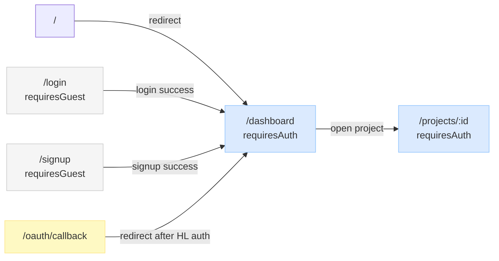

**Auth Guard logic** (`router/index.ts`):

- `requiresAuth` → redirect to `/login` if not authenticated
- `requiresGuest` → redirect to `/dashboard` if already authenticated
- Auth store's `init()` is awaited before any navigation decision

---

### 4.2 Workspace Layout

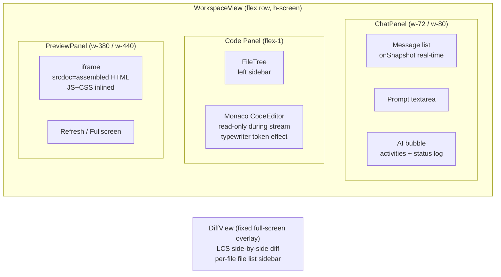

All three panels can be toggled on/off via header buttons. **Fullscreen mode** hides chat + code panels. **DiffView** renders as a fixed full-screen overlay, activated automatically after each generation that modifies existing files.

---

### 4.3 Pinia Store Dependency Graph

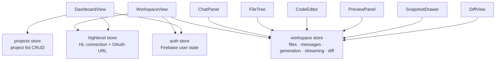

---

### 4.4 Workspace Store — Internal State

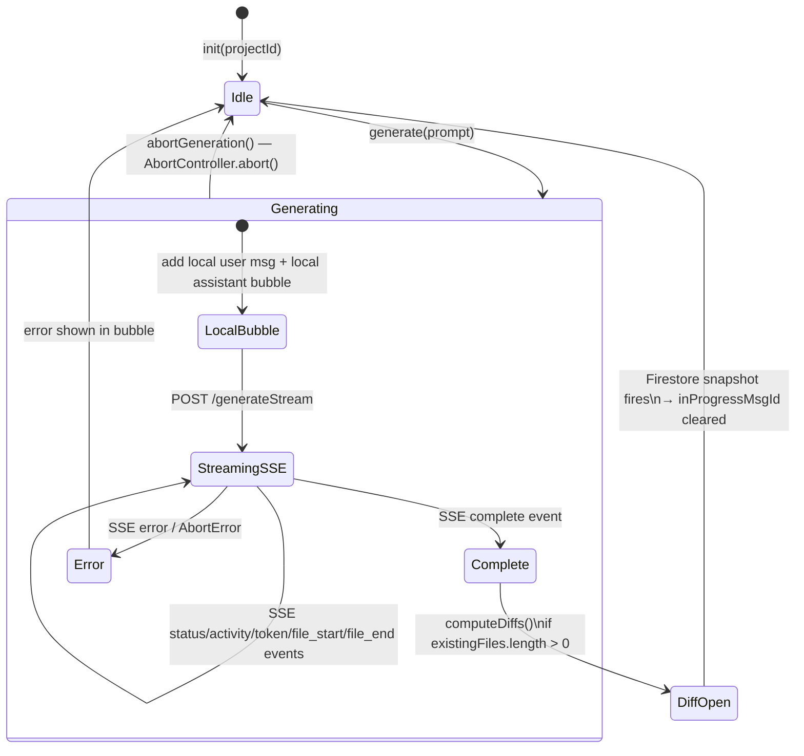

**Key refs in workspace store:**

| Ref                     | Type                      | Purpose                                                                                        |
| ----------------------- | ------------------------- | ---------------------------------------------------------------------------------------------- |
| `messages`              | `Message[]`               | Merged Firestore remote + local in-progress bubble                                             |
| `inProgressMsgId`       | `string \| null`          | ID of local assistant bubble shown during generation                                           |
| `inProgressStartTime`   | `number \| null`          | Epoch ms when generation started — used to distinguish new vs old Firestore assistant messages |
| `streamingFileContents` | `Record<string, string>`  | Live file content accumulating from SSE token events                                           |
| `activeStreamFile`      | `string \| null`          | Which file is currently receiving token chunks                                                 |
| `generationState`       | `GenerationState`         | `isGenerating`, `status`, `error`, `currentFile`                                               |
| `filesBeforeGeneration` | `{path,content}[]`        | Snapshot of files captured before generation starts — used for diff computation                |
| `diffView`              | `DiffViewState`           | `isOpen`, `generationId`, `diffs[]`, `selectedPath`                                            |
| `abortController`       | `AbortController \| null` | Allows mid-generation cancellation via `abortGeneration()`                                     |

---

## 5. Backend Architecture (Cloud Functions)

### 5.1 Function Inventory

| Function          | Trigger      | Auth                  | Purpose                                                   |
| ----------------- | ------------ | --------------------- | --------------------------------------------------------- |
| `generateStream`  | HTTPS POST   | Firebase ID token     | Main AI generation — SSE stream (512MB, 300s timeout)     |
| `highlevelProxy`  | HTTPS GET    | Firebase ID token     | Proxy all HL CRM API calls from generated apps            |
| `hlOAuthCallback` | HTTPS GET    | None (OAuth redirect) | Exchange HL auth code → tokens, store in Firestore        |
| `listProjects`    | HTTPS GET    | Firebase ID token     | List user's non-deleted projects                          |
| `createProject`   | HTTPS POST   | Firebase ID token     | Create new project                                        |
| `updateProject`   | HTTPS PATCH  | Firebase ID token     | Rename / re-describe project                              |
| `deleteProject`   | HTTPS DELETE | Firebase ID token     | Soft-delete (sets `deletedAt`)                            |
| `listFiles`       | HTTPS GET    | Firebase ID token     | List files in a project (path ordered)                    |
| `getFile`         | HTTPS GET    | Firebase ID token     | Get single file content                                   |
| `saveFile`        | HTTPS POST   | Firebase ID token     | Upsert a file manually (also updates project `updatedAt`) |
| `listSnapshots`   | HTTPS GET    | Firebase ID token     | List last 20 generation snapshots                         |
| `restoreSnapshot` | HTTPS POST   | Firebase ID token     | Restore all files to a past snapshot (batch write)        |

---

### 5.2 Auth Middleware

Every function (except `hlOAuthCallback`) calls `verifyAuth(req)` as its first step:

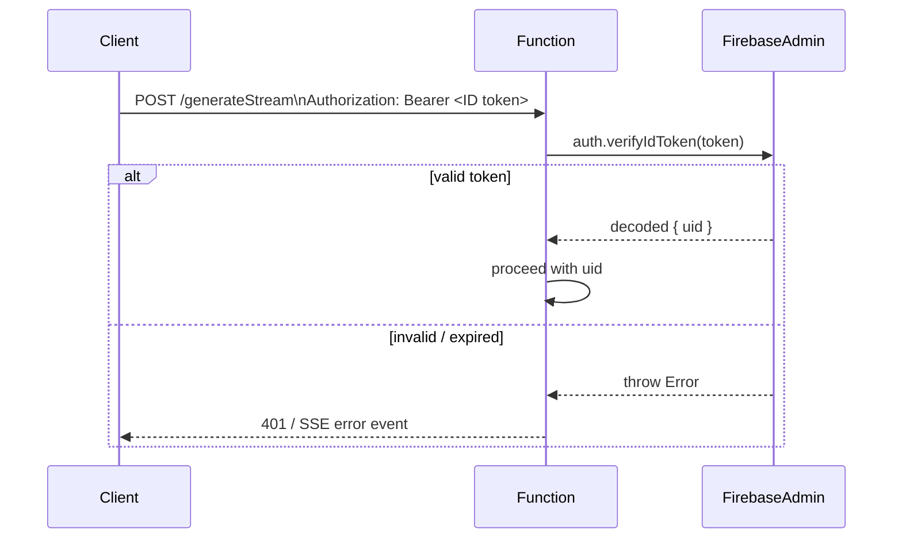

---

### 5.3 generateStream — Internal Flow

```mermaid
flowchart TD
    Start([POST /generateStream]) --> CORS[setCors headers]
    CORS --> Auth[verifyAuth → uid]
    Auth --> RateCheck[checkRateLimit\n10 req/min per uid\nFirestore sliding window]
    RateCheck -- exceeded --> RateError[SSE error event\n→ res.end]
    RateCheck -- allowed --> LoadProject[Load project from Firestore\nverify ownership]
    LoadProject --> LoadFiles[Load existing files\n→ send file_read activities]
    LoadFiles --> LoadHistory[Load last 10 messages\nfilter summaries + delimiter artifacts]
    LoadHistory --> SaveUserMsg[Save user message to Firestore]
    SaveUserMsg --> BuildPrompt[buildSystemPrompt\nHL context + proxy URL + output format]

    BuildPrompt --> LLMChoice{USE_HUGGINGFACE?}

    LLMChoice -- "true\nDelimiter format" --> HF[HuggingFace stream\nQwen2.5-Coder-7B\nDelimiterStreamParser\nreal-time file_start/token/file_end events]
    LLMChoice -- "false\nJSON format" --> AN[Anthropic stream\nclaude-sonnet-4-6\nassistant prefill '['\naccumulate full response\nperiodic kb progress SSE\nthen typewriter replay]

    HF --> Parse1[parseLLMResponse\ndelimiter → JSON fallback]
    AN --> Parse2[parseLLMResponse\njsonOnly=true]

    Parse1 --> ValidateOps[Validate operations\npath.length ≤200\nmust have extension\nno < or newlines in path]
    Parse2 --> ValidateOps

    ValidateOps --> BatchWrite[Firestore batch.commit\nwrite/delete files]
    BatchWrite --> UpdateProject[Update project.updatedAt]
    UpdateProject --> CreateSnapshot[createSnapshot\nmerge existing + new − deleted]
    CreateSnapshot --> SaveAssistantMsg[Save assistant message\nwith activities array]
    SaveAssistantMsg --> SendComplete[SSE complete event\n{generationId, snapshotId, filesCount, summary}]
    SendComplete --> End([res.end])
```

---

### 5.4 HighLevel API Client

`highlevel/client.ts` creates a per-request Axios instance with two interceptors:

1. **Request interceptor** — calls `refreshHighLevelToken(userId)` before every request, auto-injecting a fresh Bearer token. Token is refreshed if within 5 minutes of expiry.
2. **Response interceptor** — catches 401 responses, retries once with a freshly refreshed token (handles race conditions where token expired mid-request). Throws after one retry.

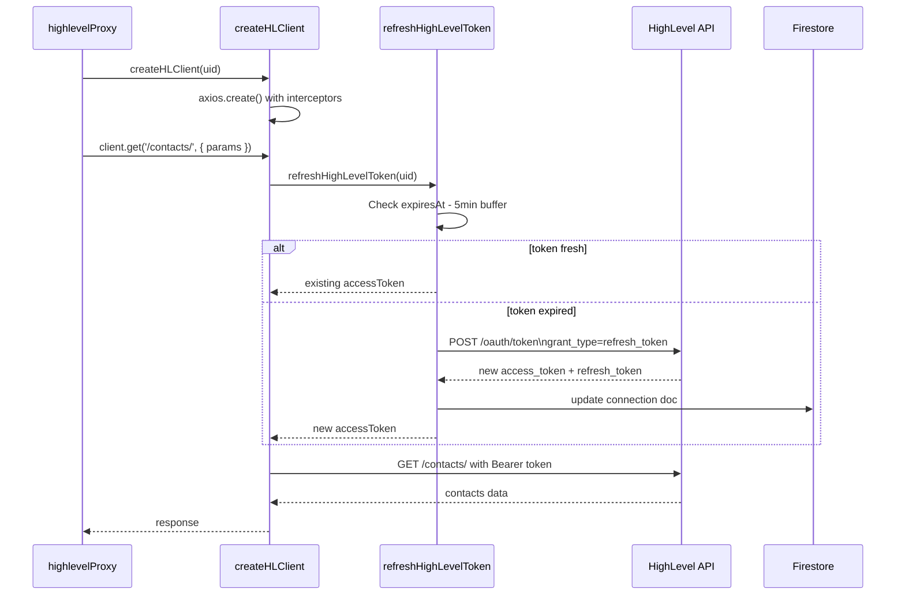

---

### 5.5 Secrets Management

Secrets are declared using Firebase Functions `defineSecret` in `functions/src/secrets.ts`:

```typescript
export const ANTHROPIC_API_KEY = defineSecret('ANTHROPIC_API_KEY')
export const HIGHLEVEL_CLIENT_ID = defineSecret('HIGHLEVEL_CLIENT_ID')
export const HIGHLEVEL_CLIENT_SECRET = defineSecret('HIGHLEVEL_CLIENT_SECRET')
export const HF_TOKEN = defineSecret('HF_TOKEN')
```

In production, secrets are set via:

```bash
firebase functions:secrets:set ANTHROPIC_API_KEY
```

In local development, they are read from `functions/.env` (never committed — see `.env.example`).

---

## 6. Data Flow — Generation Pipeline

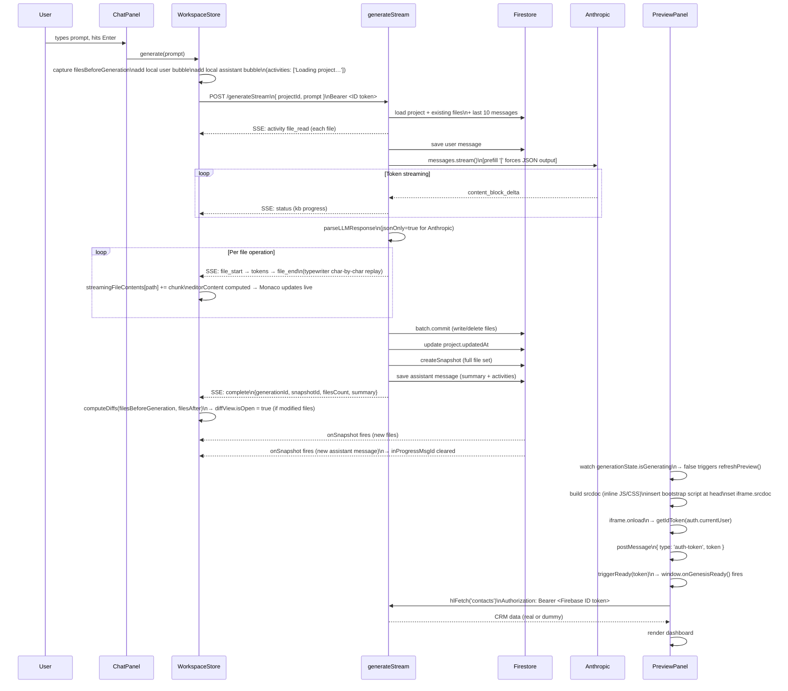

---

## 7. SSE Event Protocol

All events follow the format:

```
event: <type>\n
data: <JSON>\n
\n
```

| Event Type   | Data Shape                                                | Description                                                                     |
| ------------ | --------------------------------------------------------- | ------------------------------------------------------------------------------- |
| `status`     | `{ type, message: string }`                               | Human-readable progress update (e.g., "Thinking…", "Generating… 2.5kb written") |
| `activity`   | `{ type, kind, label, path? }`                            | Structured activity log entry (file_read, file_write, file_delete, summary)     |
| `file_start` | `{ type, path: string }`                                  | Begin streaming a new file                                                      |
| `token`      | `{ type, text: string }`                                  | Content chunk for current file (typewriter effect in Monaco)                    |
| `file_end`   | `{ type, path: string }`                                  | Current file fully streamed                                                     |
| `complete`   | `{ type, generationId, snapshotId, filesCount, summary }` | Generation successful                                                           |
| `error`      | `{ type, message: string, savedFilesCount?: number }`     | Generation failed (partial saves indicated)                                     |

### Dual-mode token delivery

**Anthropic path**: The full response is accumulated silently (JSON looks noisy mid-stream). After parsing, each file's content is replayed in 80-character chunks as `token` events — creating a typewriter effect in the editor.

**HuggingFace path**: `DelimiterStreamParser` processes raw token chunks in real time. `file_start`/`token`/`file_end` events fire as the model outputs `<<<FILE:path>>>` ... `<<<END_FILE>>>` delimiters.

---

## 8. HighLevel OAuth & API Flow

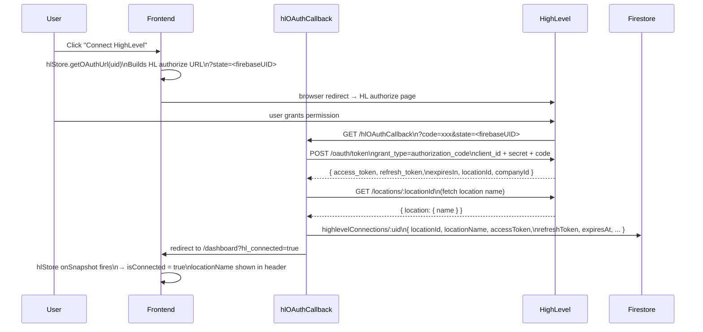

### HL API Endpoints Used

| Resource       | Endpoint                           | Notes                                                                                                                                                    |
| -------------- | ---------------------------------- | -------------------------------------------------------------------------------------------------------------------------------------------------------- |
| Contacts list  | `GET /contacts/`                   | Cursor pagination via `startAfter` (Unix ms) + `startAfterId`. **Note:** `skip` parameter rejected by HL with 422.                                       |
| Contact create | `POST /contacts/`                  |                                                                                                                                                          |
| Contact update | `PUT /contacts/:id`                |                                                                                                                                                          |
| Conversations  | `GET /conversations/search`        | Pagination via `startAfterDate`                                                                                                                          |
| Messages       | `GET /conversations/:id/messages`  |                                                                                                                                                          |
| Send message   | `POST /conversations/:id/messages` | type: SMS                                                                                                                                                |
| Calendars      | `GET /calendars/`                  |                                                                                                                                                          |
| Appointments   | `GET /calendars/events`            | Requires at least one of: `calendarId`, `userId`, `groupId`. Auto-fetches first calendar if none provided. Time params are Unix ms (converted from ISO). |
| Availability   | `GET /calendars/:id/free-slots`    |                                                                                                                                                          |
| Token exchange | `POST /oauth/token`                | `application/x-www-form-urlencoded` (NOT JSON)                                                                                                           |
| Token refresh  | `POST /oauth/token`                | `grant_type=refresh_token`. New refresh token issued each time — old one invalidated.                                                                    |
| Location name  | `GET /locations/:id`               | Version header: `2021-07-28`                                                                                                                             |

---

## 9. Firestore Data Model

```
/users/{userId}
  email, displayName, createdAt

/highlevelConnections/{userId}        ← doc ID = Firebase UID
  userId, locationId, locationName
  accessToken, refreshToken, expiresAt
  companyId, createdAt, updatedAt

/projects/{projectId}
  userId, name, description
  highLevelLocationId
  createdAt, updatedAt, deletedAt     ← null unless soft-deleted

  /files/{fileId}                     ← fileId = path.replace(/\//g, '__')
    path, content, updatedAt

  /snapshots/{snapshotId}
    generationId
    files: [{ path, content }]        ← full file set at generation time
    createdAt

  /messages/{messageId}
    projectId, role (user|assistant)
    content                           ← summary text for assistant messages
    activities?: [{ kind, label, path? }]
    createdAt

/_rateLimits/{uid__endpoint}          ← admin SDK only, client denied
  uid, endpoint, count, windowStart
  updatedAt
```

### Firestore Indexes

| Collection  | Fields                            | Order     |
| ----------- | --------------------------------- | --------- |
| `projects`  | `userId ASC`, `createdAt DESC`    | composite |
| `snapshots` | `projectId ASC`, `createdAt DESC` | composite |
| `messages`  | `projectId ASC`, `createdAt ASC`  | composite |

---

## 10. Preview Iframe Architecture

```mermaid
flowchart TD
    subgraph Files["Project files (Firestore)"]
        IndexHTML[index.html]
        AppJS[app.js]
        StyleCSS[style.css]
    end

    subgraph PreviewPanel["PreviewPanel.vue — srcdoc computation"]
        A[Start with index.html content]
        B["Replace <script src='app.js'> with inline <script>"]
        C["Replace <link href='style.css'> with inline <style>"]
        D["Inject bootstrap script at <head>\n(before generated app's own bootstrap)"]
        E[Set iframe.srcdoc]
    end

    subgraph IframeRuntime["iframe runtime (sandboxed origin)"]
        Boot[Bootstrap script runs\nRegisters message + genesis-ready listeners\nDefines window.hlFetch globally]
        App[Generated app JS runs\nSets window.onGenesisReady = function() {...}]
        Token[parent postMessage\n{ type: 'auth-token', token }]
        Ready[triggerReady(token)\n→ window.onGenesisReady() called]
        Fetch["hlFetch('contacts', { limit: 20 })\n→ fetch /highlevelProxy?resource=contacts\nAuthorization: Bearer <token>"]
    end

    IndexHTML --> A
    AppJS --> B
    StyleCSS --> C
    A --> B --> C --> D --> E

    E --> Boot
    Boot --> App
    Token --> Ready
    App --> Ready
    Ready --> Fetch
```

**Bootstrap injection**: The PreviewPanel always injects its own bootstrap at the very top of `<head>`, even if the generated app already includes one. This guarantees `hlFetch` and the `auth-token` message listener are always defined, even when the LLM forgets to include the bootstrap in its output.

**Sandbox attributes**: `allow-scripts allow-same-origin allow-forms allow-popups`

**Auto-refresh triggers**:

- When `generationState.isGenerating` transitions from `true` → `false`
- When any file's `path + updatedAt` changes (snapshot restore, manual save)

---

## 11. Authentication Flow

```mermaid
flowchart TD
    AppStart[App loads\nmain.ts] --> RouterInit[router.beforeEach\nawait authStore.init()]
    RouterInit --> AuthListener[onAuthStateChanged\nFirebase SDK]

    AuthListener -- "user exists" --> Authenticated[firebaseUser = user\nisAuthenticated = true]
    AuthListener -- "no user" --> Guest[firebaseUser = null\nisAuthenticated = false]

    Authenticated --> Dashboard[→ /dashboard]
    Guest --> Login[→ /login]

    Login --> LoginForm[email + password]
    LoginForm --> FirebaseAuth[signInWithEmailAndPassword]
    FirebaseAuth -- success --> TokenStore[Firebase SDK stores\nID token + refresh token\nin localStorage]
    TokenStore --> RouteGuard[router redirects\nto /dashboard]

    TokenStore --> AutoRefresh[Firebase SDK auto-refreshes\nID token every ~55 min]
    AutoRefresh --> APICall[All CF calls:\ngetIdToken → Bearer header]
```

---

## 12. LLM Response Parsing Pipeline

The parser (`generation/parser.ts`) uses a **6-strategy waterfall** — each strategy is attempted in order, stopping at the first that yields at least one file operation.

````mermaid
flowchart TD
    Input[LLM raw response string] --> S1

    S1{"Strategy 1\nDelimiter format\nSkipped if jsonOnly=true"}
    S1 -- "<<<FILE:path>>>\n...content...\n<<<END_FILE>>>" --> Ops[FileOperation array]
    S1 -- not found --> S2

    S2{"Strategy 2\nStrip markdown fences\ndirect JSON.parse"}
    S2 -- valid JSON array --> Ops
    S2 -- fails --> S3

    S3{"Strategy 3\nBracket extraction\noutermost [ ... ]\nJSON.parse"}
    S3 -- valid --> Ops
    S3 -- fails --> S4

    S4{"Strategy 4\nJSON string repair\nescape bare newlines\nthen parse"}
    S4 -- valid --> Ops
    S4 -- fails --> S5

    S5{"Strategy 5\nRegex object extraction\npull path + operation\n+ content manually"}
    S5 -- found --> Ops
    S5 -- nothing --> S6

    S6{"Strategy 6\nMarkdown block extraction\n``` html/js/css blocks\nmapped to filenames"}
    S6 -- blocks found --> Ops
    S6 -- nothing --> Error[return operations=[]\nwarn in logs]

    Ops --> Validate["For each operation:\npath.length ≤ 200\nmust match /\.[a-z]{1,5}$/\nno < or newlines in path"]
    Validate --> Clean["sanitizePath\nstrip ../ prefixes\nstrip leading /"]
    Clean --> Return[FileOperation[]]
````

### LLM Output Formats

**Anthropic path (JSON)** — `jsonOnly=true` skips Strategy 1:

```json
[
  { "operation": "write", "path": "index.html", "content": "<!DOCTYPE html>..." },
  { "operation": "write", "path": "app.js", "content": "window.onGenesisReady = ..." },
  { "operation": "delete", "path": "old.js" }
]
```

**HuggingFace path (Delimiters)** — real-time streaming via `DelimiterStreamParser`:

```
<<<FILE:index.html>>>
<!DOCTYPE html>...
<<<END_FILE>>>
<<<DELETE:old.js>>>
```

**Anthropic Prefill Trick**: An assistant turn starting with `[` is appended before the API call. This forces Claude to continue outputting a JSON array — it cannot switch to plain text or delimiters because it has already "started" with `[`. Delimiter-format assistant messages in conversation history are also stripped to prevent format bleed-over.

**Path validation**: Paths are rejected if `length > 200`, contain `<` (HTML tags), contain `\n` (newlines), or lack a file extension. This guards against the case where the LLM puts entire file content in the `path` field when it mixes output formats.

---

## 13. Snapshot System

Every successful generation creates a **full snapshot** — a complete copy of all files at that point in time.

```mermaid
flowchart LR
    Gen[Generation completes] --> MergeFiles["Merge:\nexistingFiles map\n+ newlySavedFiles\n− deletedFiles"]
    MergeFiles --> SnapDoc["snapshots/:snapshotId\n{ generationId, files[], createdAt }"]

    Restore[User clicks Restore] --> ListSnaps[GET /listSnapshots\nshows last 20]
    ListSnaps --> PickSnap[User picks a snapshot\nin SnapshotDrawer sheet]
    PickSnap --> RestoreCall[POST /restoreSnapshot\n{ projectId, snapshotId }]
    RestoreCall --> DeleteAll[batch.delete\nall current files]
    DeleteAll --> RewriteAll[batch.set\nall snapshot files]
    RewriteAll --> Firestore[Firestore\nonSnapshot fires\nUI + Preview update instantly]
```

**Snapshot storage**: Full file contents (not diffs). Trade-off: simple and reliable restore; storage grows linearly with generations. Acceptable at this scale.

**Retention**: Last 20 snapshots shown per project (no automatic pruning currently).

---

## 14. Diff View System

After each generation that modifies existing files, Genesis automatically computes and displays a side-by-side diff.

### 14.1 Diff Computation (workspace store)

```
filesBeforeGeneration  ←  captured at generate() start
filesAfter             ←  streamingFileContents + unchanged Firestore files
                           (uses streaming content since Firestore may not be updated yet)

computeDiffs(before, after, generationId):
  → For each path in union(before.keys, after.keys):
      if only in after  → status: 'added'
      if only in before → status: 'deleted'
      if content differs → status: 'modified'
      (unchanged paths excluded — not useful to show)
  → Sort: added → modified → deleted → path alphabetical
  → diffView.isOpen = true (if diffs.length > 0)
```

**First generation**: Diff is skipped — `filesBeforeGeneration.length === 0`, so there is nothing to compare.

### 14.2 DiffView Component

`DiffView.vue` renders as a fixed full-screen overlay with:

- **File list sidebar** — lists all changed files with status icon (green + for added, yellow pencil for modified, red × for deleted) and badge counts in the header
- **Side-by-side diff panel** — uses an LCS (Longest Common Subsequence) DP algorithm to produce line-level diff segments tagged `same`, `added`, or `removed`. Removed lines highlighted red, added lines highlighted green.
- **Line numbers** — both sides display 1-based line numbers

```
computeLineDiff(before, after):
  Uses O(m×n) DP table (bLines × aLines) to find LCS
  Walks DP table to produce left[] (before) + right[] (after) LineSeg arrays
  LineSeg: { type: 'same' | 'added' | 'removed', lineNo, text }
```

---

## 15. Rate Limiting

Genesis implements **Firestore-backed sliding-window rate limiting** (`functions/src/rateLimit.ts`) on the two most expensive endpoints.

### 15.1 Configuration

| Endpoint         | Window | Max Requests |
| ---------------- | ------ | ------------ |
| `generateStream` | 60 sec | 10 per uid   |
| `highlevelProxy` | 60 sec | 60 per uid   |

### 15.2 Algorithm

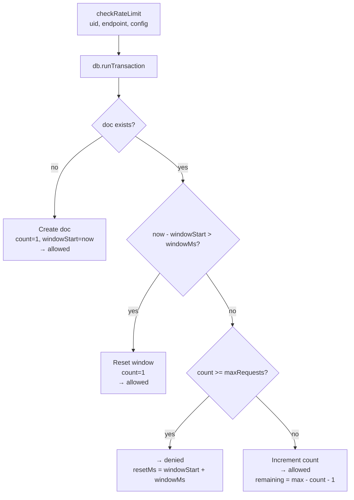

**Fail-open**: If the Firestore transaction throws (network issue, contention), the function fails open — the request is allowed and `remaining=0` is returned. This avoids blocking legitimate traffic on infrastructure hiccups.

**Storage**: `/_rateLimits/{uid__{endpoint}}` collection — locked to admin SDK only via Firestore security rules (`allow read, write: if false`).

**Rate limit response** (SSE error event for `generateStream`):

```json
{ "type": "error", "message": "Rate limit exceeded. Try again in 42s (max 10 generations/min)." }
```

---

## 17. State Management (Pinia Stores)

### 17.1 `auth` store

```
state: firebaseUser, loading, error
getters: user (mapped to { uid, email, displayName }), isAuthenticated
actions: init() → onAuthStateChanged listener
         signup(email, password, name) → createUserWithEmailAndPassword
         login(email, password) → signInWithEmailAndPassword
         logout() → signOut
         clearError()
```

### 17.2 `highlevel` store

```
state: connection (HL connection doc), loading
getters: isConnected, locationName, locationId
actions: init() → onSnapshot highlevelConnections/:uid
         getOAuthUrl(uid) → builds HL OAuth authorize URL with state=uid
         destroy() → unsubscribe
```

### 17.3 `projects` store

```
state: projects[], loading, error
actions: fetchProjects() → GET /listProjects
         createProject(input) → POST /createProject
         updateProject(id, input) → PATCH /updateProject/:id
         deleteProject(id) → DELETE /deleteProject/:id
```

### 17.4 `workspace` store (most complex)

```
state:
  projectId, files[], messages[], snapshots[]
  activeFilePath, generationState
  streamingFileContents{}, activeStreamFile
  inProgressMsgId, inProgressStartTime
  filesBeforeGeneration[]
  diffView: { isOpen, generationId, diffs[], selectedPath }
  abortController (private)

computed:
  activeFile      → files.find(activeFilePath)
  fileTree        → { dir: [path, ...] } grouped by directory
  editorContent   → streamingFileContents[activeStream] ?? activeFile.content

real-time listeners:
  filesUnsub    → onSnapshot projects/:pid/files    (ordered by path)
  messagesUnsub → onSnapshot projects/:pid/messages (ordered by createdAt asc)
    └── merges remote messages with local in-progress bubble
    └── drops bubble when new remote assistant msg createdAt >= inProgressStartTime

actions:
  init(pid), destroy()
  selectFile(path), saveFile(path, content)
  generate(prompt) → full SSE flow with AbortController
  abortGeneration() → abortController.abort()
  restoreSnapshot(id), fetchSnapshots()
  computeDiffs(before, after, generationId)
  closeDiffView(), selectDiffFile(path)
```

---

## 18. Security Model

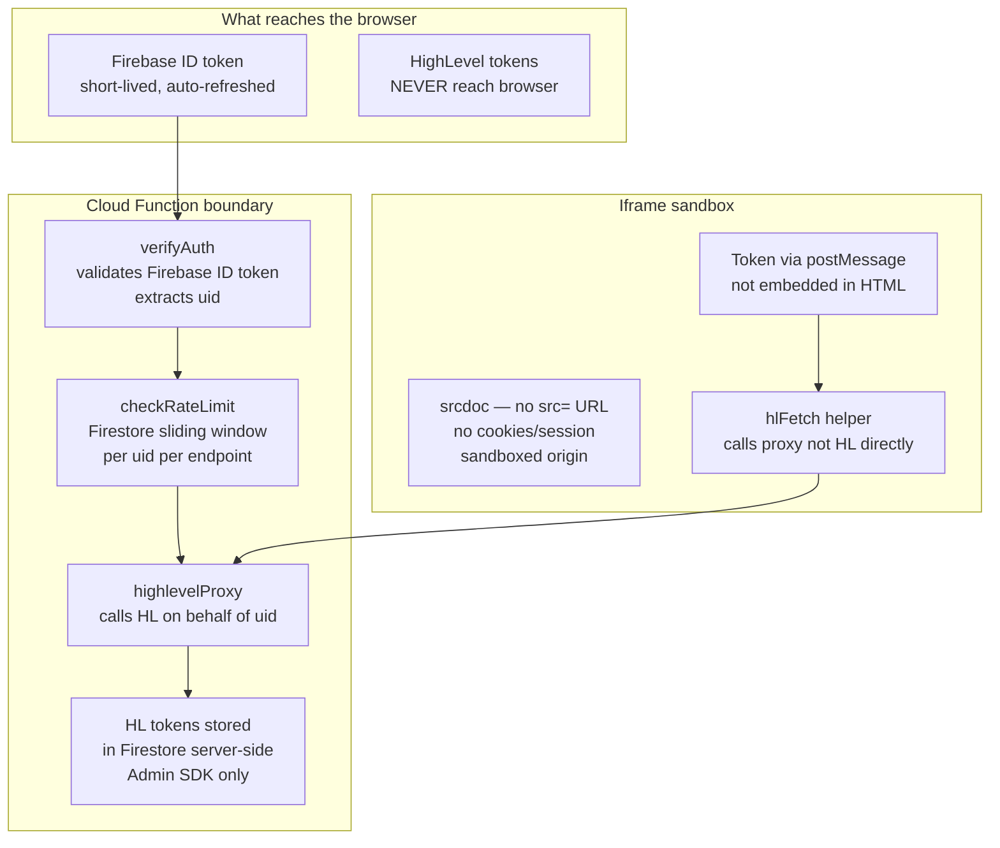

### Security Properties

| Property                          | Implementation                                                           |
| --------------------------------- | ------------------------------------------------------------------------ |
| HL tokens never in browser        | Stored in Firestore server-side, accessed via Admin SDK only             |
| Token injection without embedding | `postMessage` from parent → iframe, not in HTML source                   |
| Iframe isolation                  | `srcdoc` attribute — sandboxed origin, no cookies                        |
| Ownership enforcement             | Every CF query filters by `userId == auth.uid`                           |
| Path injection prevention         | File paths validated: max 200 chars, must have extension, no `<` or `\n` |
| Prompt injection prevention       | LLM output is a structured JSON array — validated before Firestore write |
| Rate limiting                     | Firestore sliding window per `(uid, endpoint)`, admin SDK only           |
| Soft deletes                      | `deletedAt` timestamp — no cascade issues, recoverable                   |
| Rate limit collection lockdown    | `/_rateLimits` denied to all client reads/writes via Firestore rules     |

---

## 19. Deployment Architecture

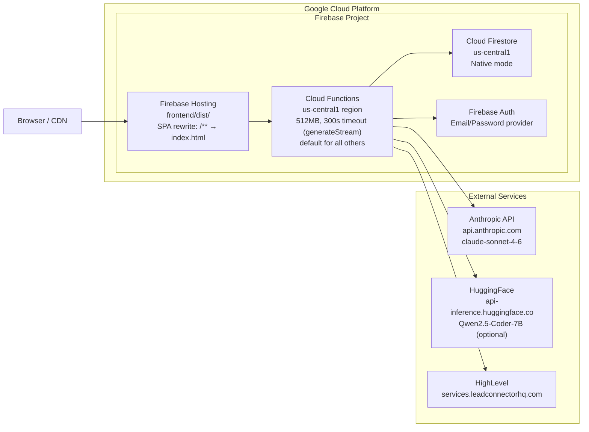

### Production Secrets (Firebase Secret Manager)

```
ANTHROPIC_API_KEY          → used in generateStream
HIGHLEVEL_CLIENT_ID        → used in hlOAuthCallback + oauth.ts
HIGHLEVEL_CLIENT_SECRET    → used in hlOAuthCallback + oauth.ts
HIGHLEVEL_REDIRECT_URI     → OAuth callback URL
FRONTEND_URL               → redirect destination after OAuth
HF_TOKEN                   → HuggingFace token (if USE_HUGGINGFACE=true)
USE_HUGGINGFACE            → 'true' to switch AI provider to Qwen
FUNCTIONS_BASE_URL         → self-reference for proxy URL injection into system prompt
```

### Build & Deploy Commands

```bash
# Full deploy
firebase deploy

# Functions only (faster iteration)
firebase deploy --only functions

# Hosting only
cd frontend && npm run build && cd .. && firebase deploy --only hosting

# Local dev
firebase emulators:start        # Terminal 1 (auth :9099, functions :5001, firestore :8080, ui :4000)
cd frontend && npm run dev       # Terminal 2 (vite :5173)
```

---

## 20. Key Design Decisions

| Decision                     | Choice                                            | Rationale                                                                                                                                              |
| ---------------------------- | ------------------------------------------------- | ------------------------------------------------------------------------------------------------------------------------------------------------------ |
| **Streaming protocol**       | Server-Sent Events (SSE)                          | One-directional stream from server. No socket infrastructure needed. Firebase functions support long-running HTTP responses.                           |
| **LLM output format**        | JSON array (Anthropic) / Delimiters (HuggingFace) | JSON is reliable for Claude. Prefill trick (`[`) locks format. Delimiter streaming enables real-time file_start/token/file_end events for HuggingFace. |
| **Preview sandboxing**       | `iframe.srcdoc`                                   | Instant preview of vanilla HTML+JS. No build step. No WebContainers overhead. JS/CSS files inlined at runtime by PreviewPanel.                         |
| **Token delivery to iframe** | `postMessage` + backup `genesis-ready` event      | Token never embedded in HTML source. Clean security boundary between parent and iframe. Bootstrap injected by PreviewPanel as safety net.              |
| **HL API access**            | Server-side proxy function                        | HL tokens never touch the browser. Correct marketplace architecture. Auto token refresh transparent to generated apps.                                 |
| **Firestore real-time**      | `onSnapshot` for files + messages                 | Instant UI update when generation completes. No polling.                                                                                               |
| **File ID scheme**           | `path.replace(/\//g, '__')`                       | Deterministic IDs for upsert-friendly writes. Firestore doc IDs cannot contain `/`.                                                                    |
| **Conversation history**     | Last 10 messages, filtered                        | Removes summary messages (UI labels) and delimiter artifacts before sending to LLM. Prevents LLM format confusion.                                     |
| **Snapshot granularity**     | Full file set per generation                      | Simple. Reliable restore. Acceptable storage at this scale.                                                                                            |
| **Soft delete for projects** | `deletedAt` field                                 | Recoverable. No Firestore cascade concerns.                                                                                                            |
| **Rate limiting**            | Firestore sliding-window, fail-open               | Per-user API cost control. Fail-open on infrastructure errors to avoid false blocks. Admin-SDK-only collection prevents client tampering.              |
| **Generation cancellation**  | `AbortController` on the SSE fetch                | User can abort mid-stream. Partial files already saved to Firestore are preserved.                                                                     |
| **Diff view**                | LCS-based line diff, side-by-side overlay         | Shows exactly what changed per generation. Uses `filesBeforeGeneration` snapshot + streaming content for immediate diff without waiting for Firestore. |
| **HL pagination (contacts)** | Cursor-based `startAfter` + `startAfterId`        | HL deprecated `skip` — using it returns 422. Cursor pagination is the only supported approach.                                                         |
| **Appointments fetch**       | Auto-fetch first calendar if none provided        | HL `/calendars/events` requires a `calendarId`. The proxy gracefully handles the case by auto-discovering the first available calendar.                |
| **inProgressStartTime fix**  | Epoch ms recorded at generation start             | Firestore listener distinguishes new vs old assistant messages. Prevents second-prompt bubble disappearing bug.                                        |

---

## 21. Environment Variables Reference

### Frontend (`frontend/.env`)

| Variable                            | Example                | Purpose                  |
| ----------------------------------- | ---------------------- | ------------------------ |
| `VITE_FIREBASE_API_KEY`             | `AIza...`              | Firebase project API key |
| `VITE_FIREBASE_AUTH_DOMAIN`         | `proj.firebaseapp.com` | Firebase Auth domain     |
| `VITE_FIREBASE_PROJECT_ID`          | `genesis-prod`         | Firebase project ID      |
| `VITE_FIREBASE_STORAGE_BUCKET`      | `proj.appspot.com`     | Firebase Storage bucket  |
| `VITE_FIREBASE_MESSAGING_SENDER_ID` | `1234567890`           | Firebase FCM sender      |
| `VITE_FIREBASE_APP_ID`              | `1:123:web:abc`        | Firebase app ID          |

### Functions (`functions/.env`)

| Variable                  | Purpose                                                         |
| ------------------------- | --------------------------------------------------------------- |
| `ANTHROPIC_API_KEY`       | Anthropic Claude API key                                        |
| `HIGHLEVEL_CLIENT_ID`     | HL Marketplace app client ID                                    |
| `HIGHLEVEL_CLIENT_SECRET` | HL Marketplace app client secret                                |
| `HIGHLEVEL_REDIRECT_URI`  | OAuth callback URL (must match HL app settings)                 |
| `FRONTEND_URL`            | Frontend URL for post-OAuth redirect                            |
| `USE_HUGGINGFACE`         | `'true'` to use Qwen instead of Claude                          |
| `HF_TOKEN`                | HuggingFace API token (required if USE_HUGGINGFACE=true)        |
| `FUNCTIONS_BASE_URL`      | Self-reference base URL — injected into system prompt for proxy |

---

## 22. API Reference

### `POST /generateStream`

**Auth**: Firebase ID token (Bearer)  
**Content-Type**: `application/json`  
**Response**: `text/event-stream`  
**Rate limit**: 10 req/min per user

```json
{ "projectId": "string", "prompt": "string" }
```

Streams SSE events. See [Section 7](#7-sse-event-protocol) for event types.

---

### `GET /highlevelProxy`

**Auth**: Firebase ID token (Bearer)  
**Rate limit**: 60 req/min per user

| Query Param | Values                                                   |
| ----------- | -------------------------------------------------------- |
| `resource`  | `contacts`, `conversations`, `appointments`, `calendars` |
| `limit`     | integer (contacts, conversations)                        |
| `query`     | search term (contacts)                                   |
| `startTime` | ISO string (appointments)                                |
| `endTime`   | ISO string (appointments)                                |

Returns real HL data if connected.

---

### `GET /listProjects` / `POST /createProject` / `PATCH /updateProject/:id` / `DELETE /deleteProject/:id`

Standard CRUD. All require Firebase Bearer token. Delete is soft (sets `deletedAt`). Create requires `name` and `highLevelLocationId`.

---

### `GET /listFiles?projectId=` / `GET /getFile?projectId=&path=` / `POST /saveFile`

File CRUD for a project. File IDs are path-based (`path.replace(/\//g, '__')`). `saveFile` uses `set(..., { merge: true })` for upserts.

---

### `GET /listSnapshots?projectId=` / `POST /restoreSnapshot`

```json
// restoreSnapshot body
{ "projectId": "string", "snapshotId": "string" }
```

`listSnapshots` returns last 20, ordered by `createdAt desc`. Restore bulk-replaces all current files in a single Firestore batch.

---

### `GET /hlOAuthCallback?code=&state=<firebaseUID>`

OAuth redirect handler. Exchanges code → tokens, fetches location name, stores in `highlevelConnections/:uid`, redirects to `FRONTEND_URL/dashboard?hl_connected=true`.

---

_Document generated from full codebase analysis of Genesis — frontend (Vue 3/Pinia/TypeScript/ShadCN) + Firebase Functions (Node 20/TypeScript) + Firestore._
